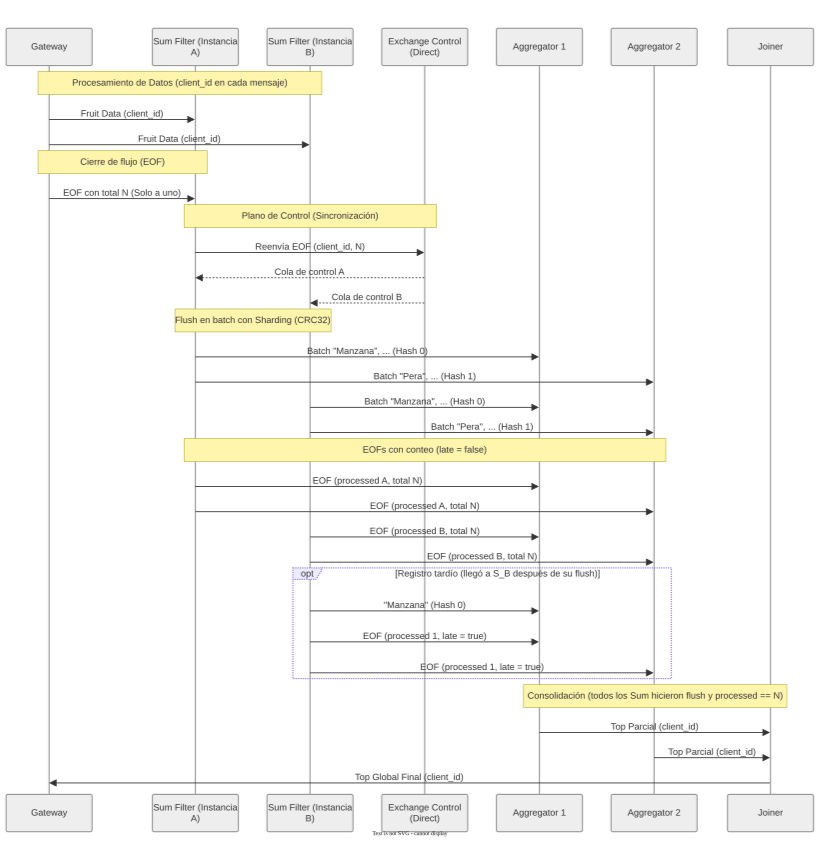

# Informe - TP Coordinación

El trabajo fue realizado en **Python**.

Como estoy recursando la materia por este tp, tome como base mis entrega del cuatrimestre pasado. Primero me traje los cambios que se hicieron en el repo desde que hice mi entraga por si habia algun cambio importante, y despues segun las correciones recibidas (principalmente con multi-client) hice los cambios necesarios.

## Correcciones de la entrega anterior

| Criterio                                  | Resultado |
| ----------------------------------------- | --------- |
| Ejecución de tests                        | Mal       |
| Ejecución de tests (Omitiendo fruit_item) | Mal       |
| Buenas prácticas de programación          | Bien      |
| Separación de clientes                    | Mal       |
| Coordinación de instancias Sum            | Bien      |
| Coordinación de instancias Aggregator     | Bien      |
| Estrategia de Join                        | Bien      |
| Manejo de señal SIGTERM                   | Bien      |
| Informe                                   | Mal       |

> No cuenta con soporte para multi-client y las pruebas automaticas fallan. Si bien la solucion con un unico cliente cumple y hay un mecanismo definido de EOF funcional, una parte importante del trabajo radica en poder garantizar resultados correctos para N clients haciendo requests concurrentemente, teniendo en cuenta que envien diferentes datos cada uno.

## Cambios realizados

- **Separación de clientes:** el `message_handler` del gateway asigna un `client_id` (uuid) a cada cliente y lo agrega a todos los mensajes internos. Sum, Aggregation y Join mantienen su estado indexado por `client_id` y lo liberan al terminar, y el gateway usa el id para devolver cada resultado a su conexión.
- **Protocolo interno:** todos los mensajes tienen la forma `{client_id, type, payload}` con dos tipos, `DATA` y `EOF`.
- **Coordinación de Sum:** la versión anterior reinyectaba un marcador de EOF en la cola de trabajo compartida, que podía ser consumido por cualquier Sum; con varias réplicas un Sum podía quedarse sin enterarse del EOF y el sistema se colgaba. Ahora cada Sum tiene su propia cola de control y el cierre se decide por conteo de registros.
- **Aggregation:** el top parcial se mantenía en una lista ordenada con `bisect` que se actualizaba en el lugar, lo que la desordenaba cuando una fruta llegaba desde varios Sum. Se reemplazó por un diccionario por fruta, y el top se calcula con `heapq.nlargest` al cerrar el cliente.
- **Uso de `FruitItem`:** el Join sumaba y ordenaba enteros directamente. Ahora toda suma y comparación se hace con `FruitItem`, por lo que el sistema respeta las implementaciones alternativas de suma y comparación.
- **Sharding:** se reemplazó MD5 por CRC32 (`zlib`), que es determinístico entre procesos y no criptográfico.
- **Graceful shutdown:** los handlers de SIGTERM solo detienen el consumo, y las conexiones se cierran cuando el loop de consumo termina. El hilo de control del Sum se detiene con `add_callback_threadsafe` de Pika.

## Mecanismos de coordinación

### Separación de clientes

Cada cliente recibe un `client_id` en el gateway, que viaja en todos los mensajes internos. Los mensajes de distintos clientes pueden intercalarse libremente en las colas, porque cada control acumula en estructuras separadas por cliente. Cuando un cliente termina, su estado se elimina.

### Coordinación de las instancias de Sum

El principal desafío del sistema es la propagación de la señal de finalización o EOF. En una arquitectura de Work Queues, el EOF enviado por el Gateway es consumido por una única instancia de Sum, dejando a las demás en una espera infinita. Además, al momento del EOF otras instancias pueden tener registros de ese cliente todavía sin procesar.

1. El gateway cuenta los registros enviados por el cliente y envía ese total `N` en el EOF.
2. El Sum que consume el EOF lo reenvía, con `N`, a la cola de control de **cada** Sum (incluida la suya) a través del exchange de control.
3. Cada Sum, al recibirlo en su hilo de control, hace el flush de ese cliente: envía sus sumas parciales y un EOF con la cantidad de registros que procesó (`processed`), el total (`total`) y `late = false`.
4. Si a un Sum le llega un registro de un cliente del que ya hizo flush (estaba en vuelo durante el flush), lo reenvía solo, con un EOF de `processed = 1` y `late = true`.

#### Justificación del uso de threads

- **Monitoreo multicanal:** cada Sum debe escuchar dos fuentes a la vez: la cola de datos (proveniente del Gateway) y su cola de control (proveniente de sus pares). Como el consumo de RabbitMQ es bloqueante (`start_consuming`), se requiere un hilo dedicado para el canal de control.
- **Thread-safety:** la librería Pika no es thread-safe. Intentar enviar datos desde un hilo mientras otro consume sobre la misma conexión provoca errores de protocolo, por lo que cada hilo publica por sus propias conexiones. Los datos y el EOF que los cuenta viajan siempre por la misma conexión, así que el EOF nunca llega antes que sus datos.
- **Estado compartido:** ambos hilos acceden al estado por cliente del Sum, que se protege con un lock.

### Coordinación de las instancias de Aggregation

Los Sum reparten las frutas entre los Aggregation con `crc32(fruta) % AGGREGATION_AMOUNT`. La función de hash tiene que garantizar **determinismo**: la misma fruta siempre mapea al mismo Aggregation, sin importar qué Sum la envíe, asegurando la consistencia del conteo distribuido. 

Un Aggregation da por completo a un cliente cuando se cumplen dos condiciones:

- recibió un EOF con `late = false` de cada uno de los `SUM_AMOUNT` Sum, y
- la suma de los `processed` recibidos es igual al `total` del cliente.

La primera garantiza que todos los Sum hicieron flush y la segunda que no quedan registros en vuelo. Al completarse, envía su top parcial al Join.

### Join

Como cada fruta pertenece a un único Aggregation, los tops parciales no comparten frutas: el Join espera los `AGGREGATION_AMOUNT` tops parciales de cada cliente, se queda con los `TOP_SIZE` mejores según `FruitItem` y envía el resultado al gateway con el `client_id`.

### Escalabilidad

**Respecto a los clientes:** cada cliente tiene estado independiente en cada control y los mensajes de distintos clientes se procesan intercalados, por lo que se atienden de forma concurrente sin esperar a que termine otro. El estado de un cliente se libera al completarse.

**Respecto a grandes volúmenes de datos:**

- Cada Sum guarda un acumulador por fruta, no por registro: la memoria depende de la cantidad de frutas distintas y no del tamaño del archivo.
- Los mensajes de control por cliente no dependen de la cantidad de registros: `SUM_AMOUNT` avisos de control y `SUM_AMOUNT × AGGREGATION_AMOUNT` EOFs. Con `prefetch_count = 1` cada Sum tiene a lo sumo un registro en vuelo, así que hay como máximo un registro tardío por Sum.
- El Aggregation actualiza cada fruta en O(1) y calcula el top con `heapq.nlargest`, sin mantener la lista ordenada.

**Respecto a la cantidad de controles:** la cola de trabajo reparte los registros entre los Sum disponibles y el sharding reparte las frutas entre los Aggregation, por lo que todas las réplicas participan. Agregar réplicas solo requiere cambiar la configuración del docker compose.

- **Colas con nombre:** el middleware usa colas con nombre fijo para los nodos con identidad (la cola de cada Aggregation y la de control de cada Sum). Se declaran al iniciar cada proceso, tanto del lado del que consume como del que publica. Esto soluciona la condición de carrera en el arranque: los mensajes esperan en el broker si el emisor es más rápido que el receptor en iniciar.
- **Reparto equitativo:** el middleware configura `prefetch_count = 1`, así que un Sum no toma un nuevo registro hasta confirmar el anterior. Los registros se reparten entre las instancias según su disponibilidad, y un registro que no llegó a confirmarse (ack) vuelve a la cola si su instancia se desconecta.
